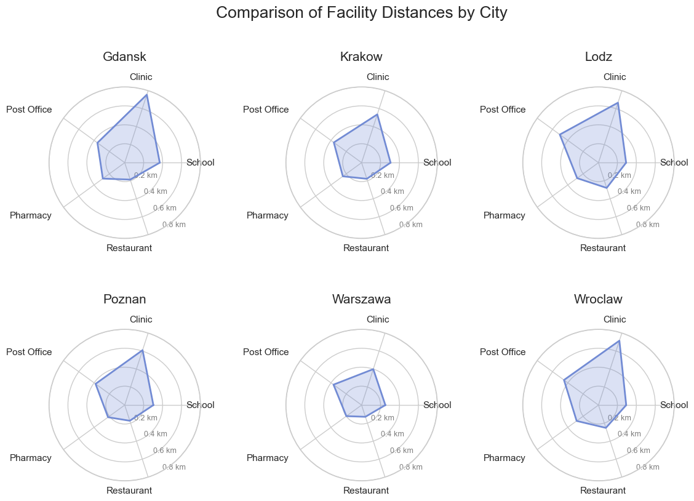
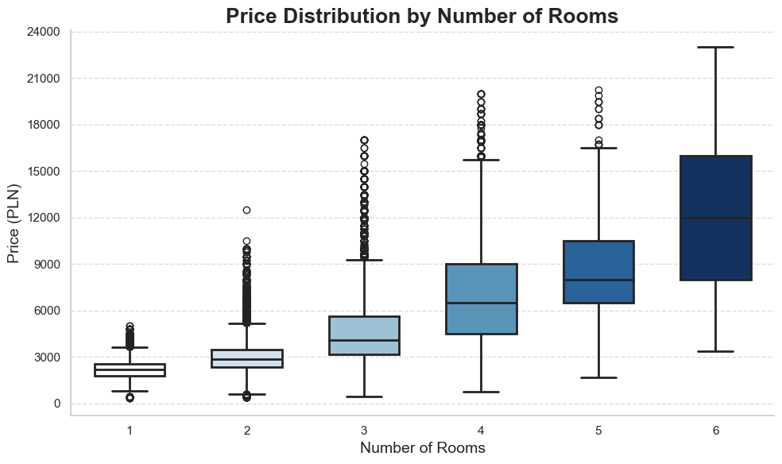
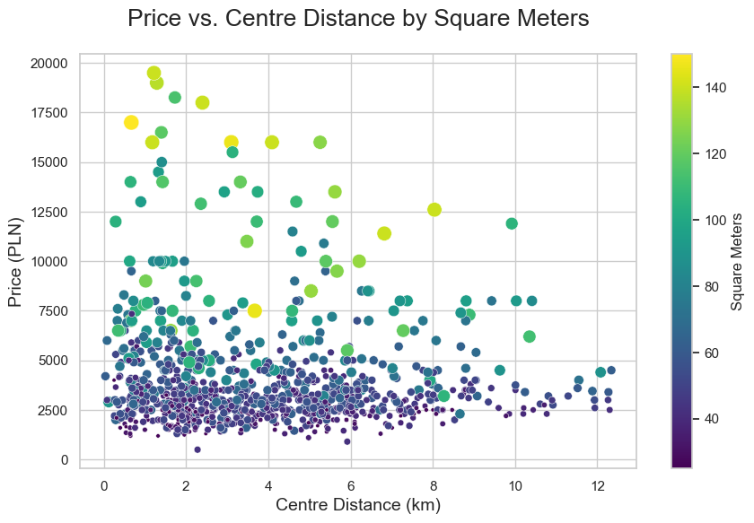
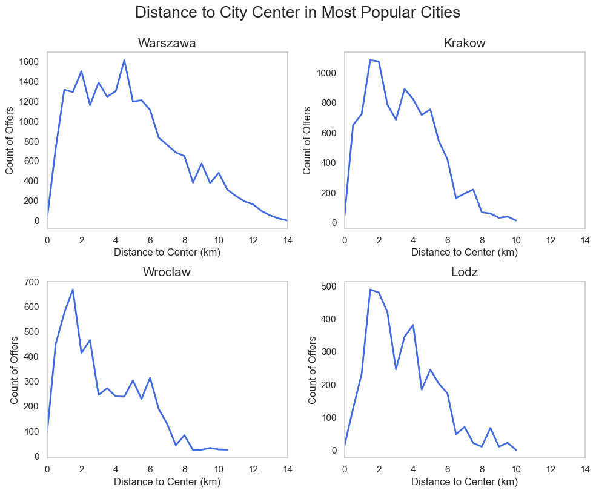
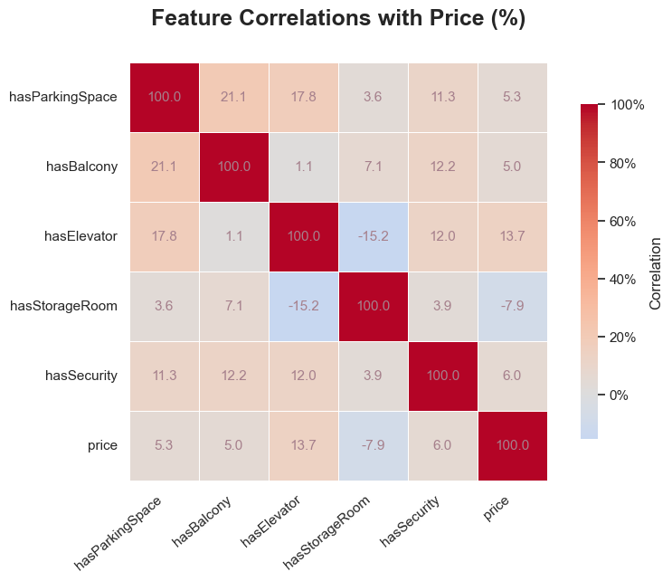
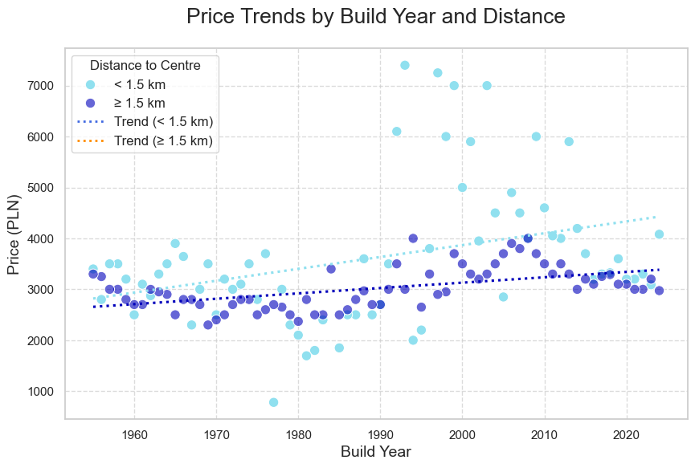
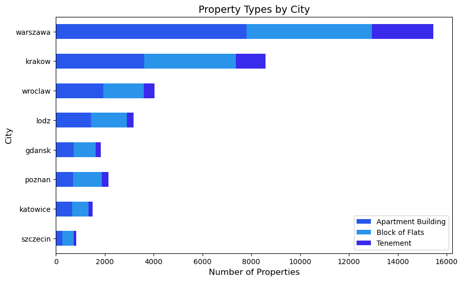

# Polish Apartment Market EDA

> [!IMPORTANT]
> Key information users need to know to achieve their goal.
> More insights and detailed descriptions can be found in the Jupyter Notebook:  
📌 [Polish_Apartment_Market_EDA.ipynb](Polish_Apartment_Market_EDA.ipynb)

## Introduction

This project explores apartment prices in Poland using Exploratory Data Analysis (EDA). The goal is to uncover trends, regional price variations, and key factors influencing property values.

### Key Questions to Analyze

* How do property prices vary across different cities and regions in Poland, and what factors contribute to these variations (e.g., property type, amenities, distance to the city center)?
* What is the correlation between the presence of amenities (e.g., parking, elevator, storage) and the price of properties in different regions?
* How does the distance to the city center influence the price ?
* How do the number of rooms, building age, and property type affect the distribution of property prices in the dataset?
* What trends can be identified in the rental or sales market ?

## Data Source

The analysis is based on the following dataset:  

- **Apartment Prices in Poland**  
  Source: [Kaggle Dataset - Apartment Prices in Poland](https://www.kaggle.com/datasets/krzysztofjamroz/apartment-prices-in-poland)  

## Tools Used

To conduct this analysis, I utilized several key tools:

* Python: The main programming language used for data analysis.
* Pandas: To load, clean, and manipulate the dataset.
* NumPy: For numerical operations and data transformati* ons.
* Matplotlib & Seaborn: For visualizing key insights and trends.
* GeoPandas: For spatial analysis and geographic visualizations. 

## Visualizations

<table>
  <tr>
    <td></td>
    <td></td>
  </tr>
  <tr>
    <td></td>
    <td></td>
  </tr>
  <tr>
    <td></td>
    <td></td>
  </tr>
  <tr>
    <td></td>
    <td></td>
  </tr>
</table>